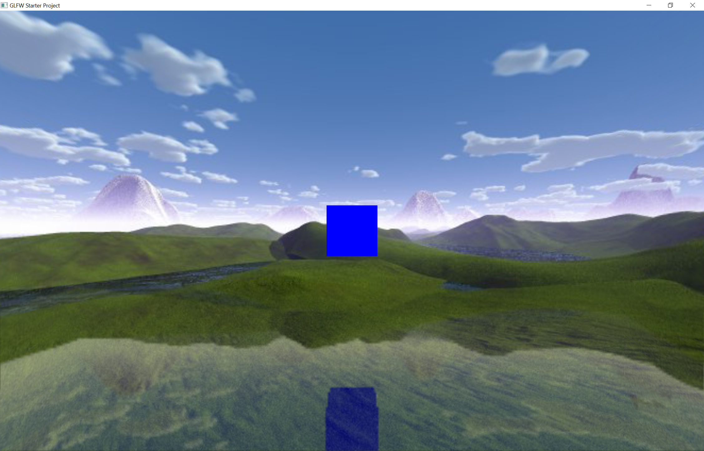
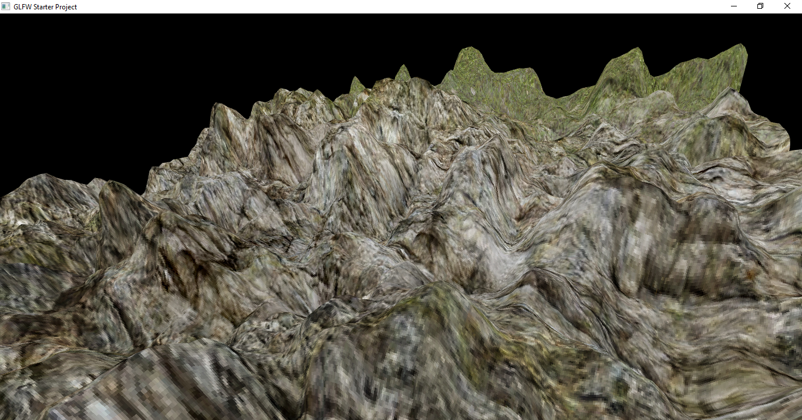
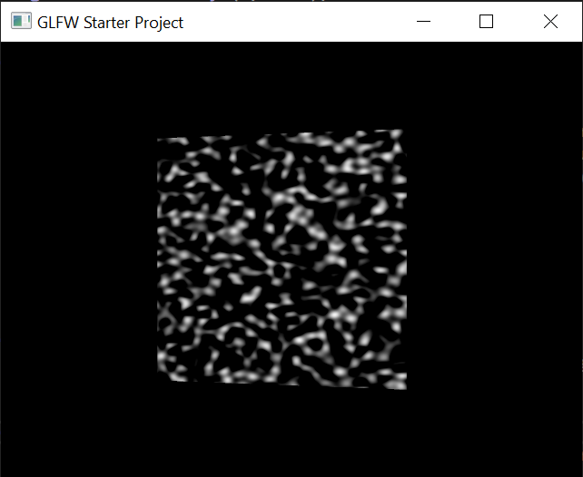
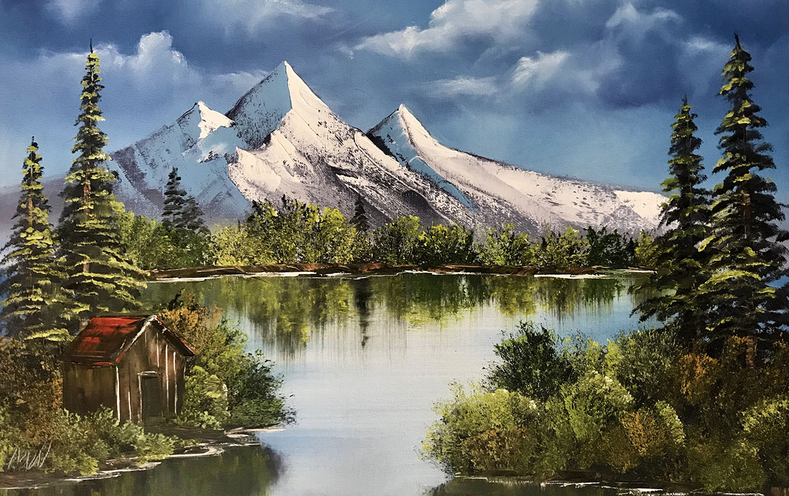
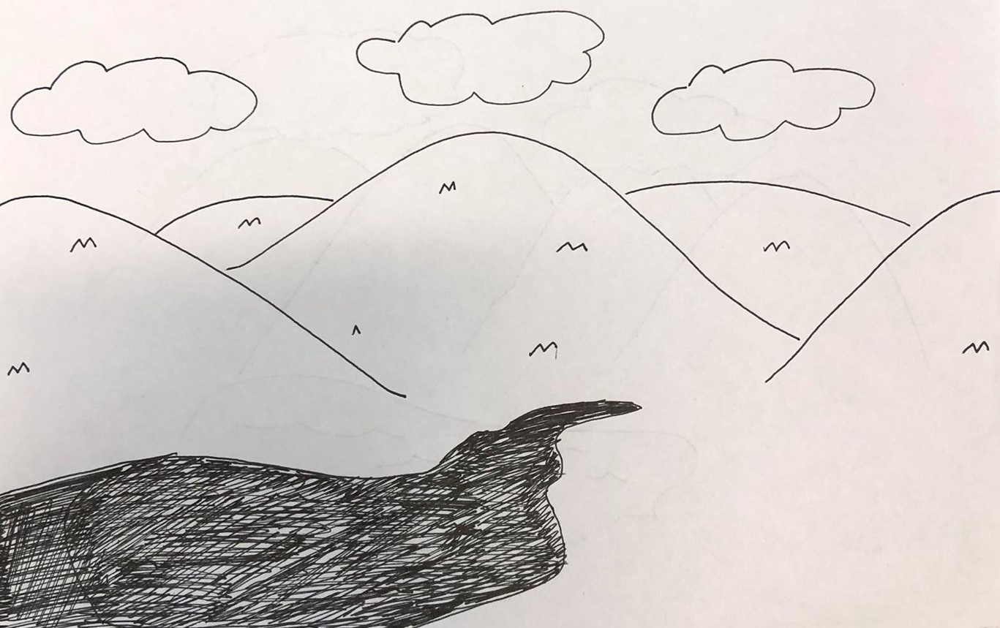

# Bob Ross project

### Blog entry #2: 3/10/2020

Our plan overall hasn't changed, so we'll just give a progress update.

We've made quite a bit of progress regarding water shading, reflections are working by rendering
the scene twice, once from the camera's perspective and once from under the water, looking up.
Here's a screenshot of our results.

For terrain generation, we have the displacement in the
vertex shader working correctly.
It mostly needs a few adjustments to the noise function to make it more realistic, plus update the textures.

For the volumetric clouds, we have implemented the 3d simplex noise function in a shader. This will be used to calculate the light transfer through a cloud volume,
following something similar to this diagram.

Here's the noise function applied to the surface of a cube.

----

### Blog entry #1: 3/4/2020

#### Group Members:
- Cynthia Butarbutar
- Louis Bo
- Thomas Lauer

#### Project Description:

Our project will be to recreate a Bob Ross style picture using realtime graphics.
Many of his paintings are landscapes, with dramatic mountains, serene lakes, and fluffy clouds.
It's a good challenge to see if we can not only implement the code, but make it integrate together in a
visually appealing way.
We will implement functionality to randomize the entire scene, so you can have a never ending supply of free paintings.
In addition, the first person controls will let you fly around the landscape to see it from different angles.

#### Techinal Features:

Feature | Points
--- | ---
Procedurally generated terrain | 2 Points
Water with realistic waves and reflections | 3 Points
Procedural generated and animated clouds | 2 Points
Procedurally generated plants with L-systems  | 2 Points
First person camera controls | 1 Point

Total: 10 Points (9 if we use water without reflections)

#### Creative Effort:
Our creative effort will be focused on tuning the elements of our scene to make them match realistically.

#### Inspiration images:
This is a good painting showing all the elements we want to implement (minus the cabin)

And here's a sketch we made. Don't judge us, we're not artists.

